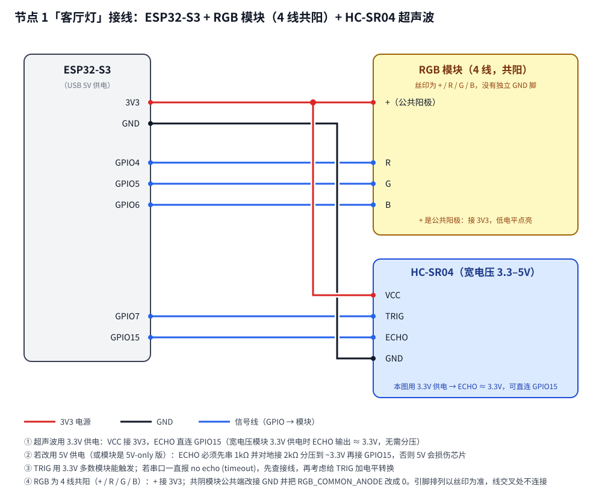
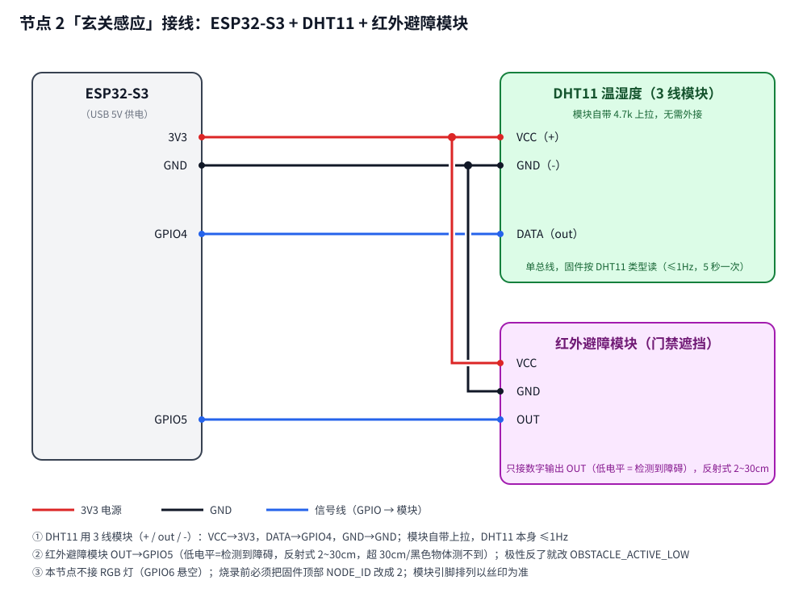
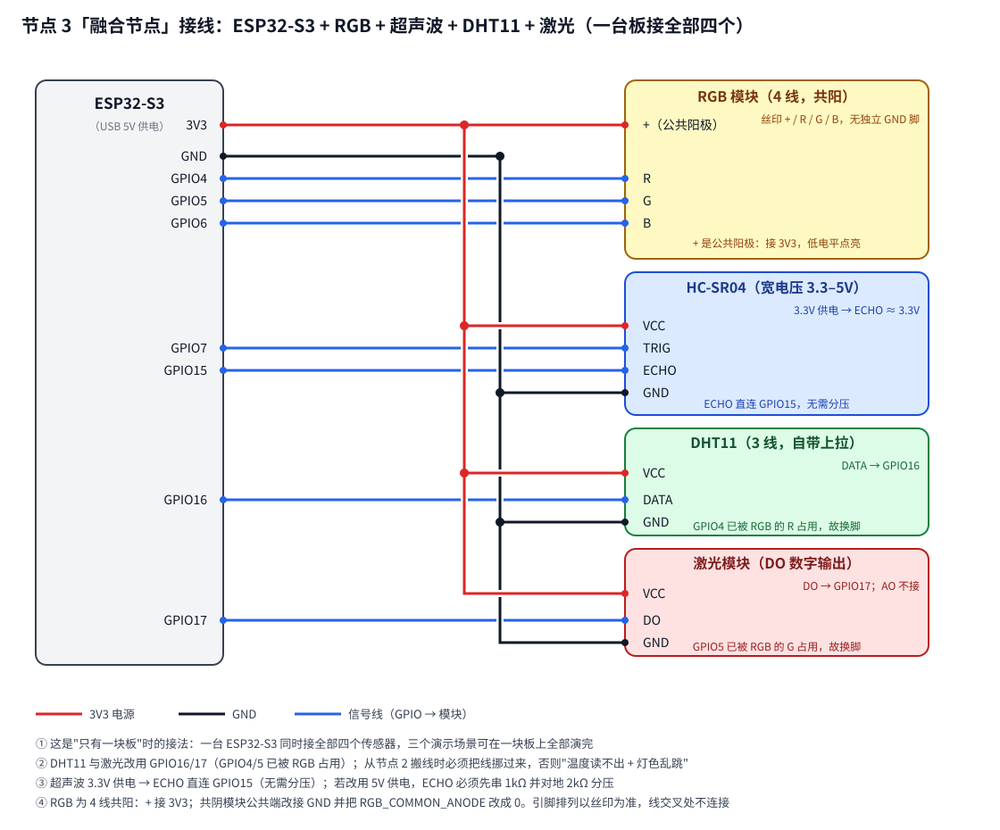

# EspNowNode — XiaoZhi 居家演示节点

ESP32-S3 节点固件，用 **arduino-esp32 核心自带**的 `ESP_NOW` 类（`ESP32_NOW.h`），
**不连接任何 AP**：开机在信道 1..13 之间 hop，收到主控的 `@beacon` 广播后锁定当前信道
并登记主控，之后双向通信。因此：

- **不需要配置 SSID / 密码 / 信道 / 主控 MAC**；
- 主控换热点、换信道，或节点/主控重启，都能自动重新发现（失联 5 秒即回到 hop）；
- **节点自描述能力**：主控固件里没有本节点的任何硬编码信息，接新设备**主控零改动**。

## 运行逻辑（各部分在干什么）

### 1. 找主控 → 锁定 → 失联自愈（`setup()` / `hopTick()` / `onNewPeerCb()`）

上电后**不连任何 AP**，直接在信道 1..13 之间每 200ms 跳一次，边跳边监听主控的 `@beacon`；
收到就锁定当前信道、登记主控（日志 `LOCKED`），并立刻上报一次能力（`info`）。
之后每收到一次 beacon 就重报一次 `info` —— 主控重启后注册表是空的，靠这个自愈。
锁定后 5 秒收不到主控任何包 → 判定失联，回到跳信道模式。

### 2. 下行：主控命令怎么走（`HomePeer::handleCommand()`）

主控发 `@n<id> do <能力> <动作> [参数]`，节点按**能力表**找 handler：

| 情况 | 回执 |
|---|---|
| 能力名对、动作认识 | 执行 → `ok <能力> <结果>` |
| 能力名对、动作不认识 | `err unknown-action` |
| 能力名不认识 | `err unknown-cap` |
| 能力是只读的，却被要求执行 | `err readonly` |

主控只把 `do` 原样转发、**不解释语义**；加新能力/新设备只改节点的能力表。

### 3. 上行：三类报文 + 队列（`queueEvt/queueSay/qCap` → `queueEvent`）

| 报文 | 用途 |
|---|---|
| `evt <名字> [值]` | 只更新主控的状态缓存，**不出声**（如 `evt temp 26 55`） |
| `say <名字>` | 请求主控播 `/sdcard/announce/<名字>.mp3`（如 `say motion`） |
| `ok` / `err …` | 动作回执 |

**可靠性设计（改这里前先读）**：

- 每条报文独立**连发 3 次**（间隔 150ms），主控按 `(kind, 名字)` 1 秒去重 ——
  跨过主控待机时 `WIFI_PS_MAX_MODEM` 的 DTIM 漏包；
- 先入 **6 槽队列**（`TXQ_SIZE`）再发，**同键合并**（键 = `@n<id> <kind> <名字>`，只留最新）——
  否则抖动中的 `dist` 会把 `say`/`ok` 挤掉，现场表现为“播报时有时无”；
  队列满会丢最旧一条并打 `WARN tx queue full, dropped oldest`；
- 入队在 ESP-NOW 回调（WiFi 任务）里、出队在 `loop()` 里，用临界区保护；
  **不要在回调里直接 `sendData()`**（真正的发送留在临界区外）。

### 4. 传感器与灯各自在做什么

| 模块 | 节奏 | 逻辑 |
|---|---|---|
| 超声波 | 100ms | 量距 → 变化 ≥3cm 或 5 秒保活才上报 `evt dist`；**<30cm 判“有人”、>40cm 复位**（迟滞防抖） |
| 自动灯 | 随超声波 | 有人 + 灯本来灭着 → 开灯、`evt motion 1`、`say motion`；人走后 30 秒自动关灯，**但用户动过这盏灯就不再自动关**（控制权交回人工） |
| DHT11 | 5s | 失败重试 3 次仍失败 → `evt err dht`；≥28℃ 播 `hot` 一次，≤26℃ 复位（迟滞） |
| 红外避障 | 50ms | 读 OUT + 二次采样去抖；**只在边沿变化**时 `evt beam`，检测到障碍才播 `beam`；上电首帧只记录、不播（避免前方已有东西时误播）|
| RGB 灯 | 收到命令时 | 亮度 = `rgb × bright ÷ 255`，共阳模块再取反（低电平点亮） |

> 这些“自动动作”（开灯、播报、阈值判断）全在节点里，主控完全不知道 ——
> 想改成“人来自动开风扇”，只需改 `sonarTick()`，主控与协议都不用动。

## 依赖

- arduino-esp32 核心 **3.2.0+**（实测 3.3.10 正常；`arduino-cli core list` 查看已装版本）
- **节点 1（客厅灯）**：零第三方库（灯用核心自带 `ledc`，无线用核心自带 `ESP_NOW`）
- **节点 2（玄关感应）/ 节点 3（融合节点）**：需要 DHT 库：

```bash
arduino-cli lib install "DHT sensor library"   # 自动带上 Adafruit Unified Sensor
```

> 固件里 `#include <DHT.h>` 放在 `#if NODE_ID == 2 || NODE_ID == 3` 内，
> 所以**编译节点 1 时不需要装这个库**。

## 协议（与主控 `espnow_home.cc` 一致，`@` 前缀文本行，单包 ≤200B）

| 方向 | 报文 | 用途 |
|---|---|---|
| 节点→主控 | `@n1 info 客厅灯 light(RGB灯):on(0\|1),rgb(r,g,b);dist(距离cm,只读):read()` | **能力自描述**：锁信道后 + 每次收到 beacon 重报 |
| 主控→节点 | `@n1 do light rgb 0 0 255` | 通用动作（主控**原样透传、不解释语义**） |
| 节点→主控 | `@n1 ok light 0 0 255` | 执行回执（主控存进该设备的状态） |
| 节点→主控 | `@n1 say motion` | **播报请求**：主控播 `/sdcard/announce/motion.mp3` |
| 节点→主控 | `@n1 evt temp 26 55` | 状态上报（只更新状态，**不播报**） |
| 节点→主控 | `@n1 err unknown-cap light` | 错误（主控会把它显示在状态里） |

### 分隔符约定（改协议前必读）

- **字段之间只用空格**：`do <能力> <动作> [参数…]`；`args` 是**剩余整段**，怎么分由各能力自己定。
  `parseNums()` 把任何非数字字符都当分隔符，所以 `0 0 255`、`0,0,255`、`[0,0,255]` 都对
  （AI 生成的参数格式不统一）。
- 为什么不用 `-` `,` `;` `:` `|` `(` `)`：这些已被 `info` 的规格语法占用（如 `bright(0-255)`），
  **空格是唯一不冲突的**，也是两侧的共同约定。
- 容错：两侧都会 trim / 跳过连续空格，AI 多打一个空格不会让命令被静默丢弃 ——
  解析不了会回 `err <原因>`，主控写进该设备状态。

## 能力表怎么填（接新设备的关键）

节点固件里**唯一**的设备描述来源是这张表，改它就能改 AI 看到的设备名与能力：

```cpp
static const CapDef kCaps[] = {
    //  能力名   规格：描述 + 动作(参数)                                 处理函数
    {"light", "(RGB灯):on(0|1),off(),rgb(r,g,b),bright(0-255),read()", capLight},
    {"dist",  "(超声波距离cm,只读):read()",                            capDistRead},
};
static const char kNodeName[] = "客厅灯";     // AI 与语音里对它的称呼
```

规则：

1. **能力名**：AI 用它搭配动作调用（`do light on 1`）。用小写英文，别用中文或空格。
2. **规格文本**：`(人类可读描述):动作(参数),动作(参数)`。**描述要写给 AI 看**——
   它会据此决定怎么调你；`|` 表示"或"，`-` 表示范围。
3. **动作名**：建议用标准词汇 `on / off / set / read`（AI 首次命中率最高），
   但**任何自定义名字都能用**（主控不校验，直接透传）。
4. **handler**：`bool f(const char* action, const char* args, char* out, size_t out_len)`，
   成功把结果文本写进 `out` 返回 `true`；不认识的动作返回 `false`（主控会收到
   `err unknown-action`）。只上报数据、不接受命令的能力填 `nullptr`（会回 `err readonly`）。
5. **单包 ≤200B**：`info` 报文总长有限，描述别写太长；主控只保留**前 4 个**能力
   （融合节点正好用满 4 个，实测报文 188B，别再拉长文案）。
6. **只读数据也要给 `read()` 动作**（返回缓存值、不要在里面阻塞采样），
   这样 AI 能主动问"现在多少度"，而不是只能等你自己上报。

**自动动作也在这个文件里**：例如"人靠近自动开灯"就是 `sonarTick()` 里
`light_on = 1; applyLight(); queueEvt("motion","1"); queueSay("motion");`——
主控完全不知道这件事，换成"自动开风扇"也只需改这里。

人离开 `MOTION_AUTO_OFF_MS`（默认 30 秒）后节点会**自动关灯**，但**只关"人来到自动开的"那盏**：
一旦你用语音（或主控）动过这盏灯，节点就把控制权交回人工并取消自动关灯
（`auto_lit` 标记；`capLight` 里除 `read` 外的任何动作都会清它）——
避免"刚说开灯、30 秒后被自动灭"。

## 接线

节点 1 与节点 2 的**引脚编号刻意做成一致**（都占用 GPIO4/5/6/7/15），但接的器件不同；
**节点 3 是融合节点**（一台设备接全部四个传感器）：RGB 与超声波沿用同样的 GPIO4/5/6/7/15，
DHT11 与红外避障模块因 GPIO4/5 已被 RGB 占用，改用 **GPIO16 / GPIO17**。

### 节点 1「客厅灯」：RGB 灯 + HC-SR04 超声波



| 元件 | 元件引脚 | 接到 ESP32-S3 | 说明 |
|---|---|---|---|
| RGB 模块（4 线共阳） | **+**（公共阳极） | 3V3 | 4 线模块**没有独立 GND 脚**，`+` 就是公共端 |
| | R / G / B | GPIO4 / GPIO5 / GPIO6 | 三通道 PWM（`ledc`）调色、调亮度 |
| HC-SR04（**宽电压 3.3–5V 版**） | VCC | **3V3** | 用 3.3V 供电，ECHO 输出也是 ~3.3V，可直连 |
| | TRIG | GPIO7 | 3.3V 一般能触发；若串口一直报 `no echo`，再给 TRIG 加电平转换 |
| | ECHO | **GPIO15（直连）** | 3.3V 供电时 ECHO ≈ 3.3V，**无需分压**；改用 5V 供电则必须先分压 |
| | GND | GND | |

> **RGB 极性**：固件默认 `RGB_COMMON_ANODE 1` = **共阳**（低电平点亮），即 4 线模块的 `+` 接 3V3。
> 若手上是**共阴**模块（公共端丝印为 `GND`），公共端改接 GND，并把该宏改成 `0`；
> 现象是“颜色反相 / 关不掉”就是极性接反了。
>
> **超声波：供电电压决定 ECHO 能不能直连（别接错）**
> - **3.3V 供电（宽电压模块，推荐，本演示用这个）**：`VCC→3V3`，`ECHO→GPIO15` **直连**，不需要电阻；
> - **5V 供电（或模块是 5V-only 版）**：`VCC→5V`，`ECHO` 必须串 1kΩ 并对地 2kΩ 分压（约 3.3V）后再进 `GPIO15`，
>   直接接 5V 会顶开 GPIO 内部 ESD 钳位二极管、把电流灌进 3.3V 轨（表现可能是 WiFi 不稳 / 偶发重启）；
> - **HC-SR04P（3.3V 版）**：接法与第一条相同，模块本身就按 3.3V 设计。
>
> 快速自检：模块 3.3V 供电、触发时用万用表量 `ECHO` 对 GND 的高电平，≈ 3.3V 即安全。

### 节点 2「玄关感应」：DHT11 + 红外避障模块



| 元件 | 元件引脚 | 接到 ESP32-S3 | 说明 |
|---|---|---|---|
| DHT11（3 线模块） | VCC | 3V3 | 模块自带上拉电阻 |
| | DATA | GPIO4 | 单总线；固件按 `DHT11` 类型读（≤ 1Hz，5 秒一次） |
| | GND | GND | |
| 红外避障模块（FC-51 类） | VCC | 3V3 | 支持 3.3–5V；只取数字输出，不用 ADC |
| | OUT（有的丝印 `DO`） | GPIO5 | **低电平 = 检测到障碍**（触发播报 `beam.mp3`） |
| | GND | GND | |
| | EN（若有第 4 脚） | 3V3 或悬空 | 使能脚，不接也能工作 |
| RGB 灯 | — | **不接** | 本节点无灯；GPIO6 悬空 |

> **红外避障模块的使用要点**（它和激光“对射”完全不同，是**反射式近距离**检测）：
> - **有效距离 2~30cm**，是“贴近检测”不是测距：手/物体靠近才触发；
> - **黑色、深色、吸光材质可能测不到**（反射太弱），用白纸或手掌测试最灵敏；
> - **怕强光**：红外受阳光/灯光直射干扰，室内用最稳，别对着窗户；
> - **模块上的蓝色电位器**就是检测距离调节，边靠近边拧到能稳定翻转；
> - **极性**：检测到障碍输出**低电平**（与激光接收模块相反），固件默认 `OBSTACLE_ACTIVE_LOW 1`；
>   若现象相反（没东西也说有人 / 靠近反而说通畅），把这一行改成 `0`。

> **共地很重要**：元件用外部电源（例如独立 5V 灯带）时，**必须与 ESP32-S3 共地**（GND 相连），
> 否则信号无参考电平，表现是“时好时坏”或完全不响应。
> **供电**：演示用低压（USB 5V / 3.3V 模块），**不要接 220V 市电**。
> 三张图只示意连接关系，模块引脚的**物理排列以实物丝印为准**；线与线交叉处**不连接**。

### 节点 3「融合节点」：四个传感器全接在一台板子上（只有一块板时用这个）



一台 ESP32-S3 同时接 RGB 灯 + 超声波 + DHT11 + 红外避障，
**带一块板就能演完全部三个场景**（人来开灯并播报、温度告警、遮挡播报）。

| 元件 | 元件引脚 | 接到 ESP32-S3 | 说明 |
|---|---|---|---|
| RGB 模块（4 线共阳） | **+** | 3V3 | 同节点 1 |
| | R / G / B | GPIO4 / GPIO5 / GPIO6 | |
| HC-SR04（宽电压 3.3–5V） | VCC | 3V3 | 3.3V 供电，ECHO 可直连（同节点 1） |
| | TRIG | GPIO7 | |
| | ECHO | GPIO15 | 3.3V 供电时无需分压 |
| | GND | GND | |
| DHT11 | VCC / GND | 3V3 / GND | |
| | DATA | **GPIO16** | **换了脚**：GPIO4 已被 RGB 的 R 占用 |
| 红外避障模块 | VCC / GND | 3V3 / GND | 低电平有效（同节点 2） |
| | OUT | **GPIO17** | **换了脚**：GPIO5 已被 RGB 的 G 占用 |
| | EN（若有） | 3V3 或悬空 | |

> **从节点 2 搬线时注意**：DHT11 与红外避障的线要从 GPIO4/5 **挪到 GPIO16/17**，
> 否则现象是“温度读不出来 + 灯颜色乱跳”（同两个引脚被 RGB 的 PWM 和传感器抢夺）。
> 这两个脚在 S3 上都是普通 IO，不撞 flash / PSRAM / USB。
>
> 固件侧 `NODE_ID 3` 的能力表有 4 个能力（`light`/`dist`/`temp`/`beam`），
> `info` 报文实测 **188B**，未超主控 200B 单包上限；因此主控 `kMaxCaps` 已从 3 提到 4。

## 编译与烧录

```bash
cd main/boards/bread-compact-wifi-s3cam-airobot/arduino/EspNowNode

# 先查端口：Windows 是 COMx，macOS 是 /dev/cu.usbserial-XXXX
arduino-cli board list

# 节点 1（客厅灯：RGB + 超声波）—— 把文件顶部 #define NODE_ID 改成 1 后重新编译烧录
arduino-cli compile --fqbn esp32:esp32:esp32s3 .
arduino-cli upload  --fqbn esp32:esp32:esp32s3 -p /dev/cu.usbserial-XXXX .

# 编译 + 上传一条命令走完（Windows 示例，端口换成实际的；想看详细编译日志再加 -v）
arduino-cli compile --upload -p COM11 --fqbn esp32:esp32:esp32s3 .

# 节点 2（玄关感应：DHT11 + 红外避障）—— 把 #define NODE_ID 改成 2 后重新编译烧录
arduino-cli compile --fqbn esp32:esp32:esp32s3 .
arduino-cli upload  --fqbn esp32:esp32:esp32s3 -p /dev/cu.usbserial-XXXX .

# 节点 3（融合节点：四个传感器接在同一块板）—— 把 #define NODE_ID 改成 3 后重新编译烧录
#   ⚠️ 节点 3 的 DHT11/红外避障接 GPIO16/17（不是节点 2 的 4/5），接线见上节
#   ⚠️ 节点 3 有 4 个能力，主控侧 kMaxCaps 需为 4（本仓库已是 4）
arduino-cli compile --fqbn esp32:esp32:esp32s3 .
arduino-cli upload  --fqbn esp32:esp32:esp32s3 -p /dev/cu.usbserial-XXXX .
```

### 构建目录与缓存（编译报异常错时先看这里）

**默认构建目录不在项目里**，而是按 sketch 目录绝对路径的 MD5 命名（大写十六进制），放在用户缓存下：

```
%LOCALAPPDATA%\arduino\sketches\<MD5(sketch 目录绝对路径)>\
# 换电脑/换仓库路径 → 哈希就变；想确认本机是哪个目录（PowerShell）：
#   Get-ChildItem "$env:LOCALAPPDATA\arduino\sketches" | Sort LastWriteTime -Descending | Select -First 3
# 本仓库这条路径对应的是：
#   C:\Users\<用户名>\AppData\Local\arduino\sketches\A5E67077465BACD07903CDF5356037F3\
```

里面是编译中间物与产物：`core/`、`libraries/`、`sketch/`、
缓存文件（`libraries.cache`、`includes.cache`、`build.options.json`）、
产物（`EspNowNode.ino.bin/.elf/.map/.merged.bin`）。
注意它**不在** `arduino-cli config dump` 的 `directories.data` 下（本机是 `D:\Arduino15`）。

**不想动默认缓存**：编译时加 `--build-path "D:/tmp/espnow_node_build"`（放临时目录，删起来干净）。

**强制全量重编 / 清理**：

```bash
arduino-cli compile --clean --fqbn esp32:esp32:esp32s3 .          # 不用任何缓存重编

rm -rf "$LOCALAPPDATA/arduino/sketches/A5E67077465BACD07903CDF5356037F3"   # 只清本 sketch 的缓存
```

```powershell
Remove-Item -Recurse -Force "$env:LOCALAPPDATA\arduino\sketches\A5E67077465BACD07903CDF5356037F3"
```

> `arduino-cli cache clean` 清的是**下载缓存**（`directories.data` 下的 staging），
> **不会**清这个 sketch 构建目录，别搞混。

**典型报错**：

```
Error during build: invalid character '\x00' looking for beginning of value
```

= 上次编译被中断（Ctrl+C / 进程被杀），把 `libraries.cache` 写成了**全零文件**。
arduino-cli 下次读它就报 JSON 解析失败，**与代码无关**。删掉缓存目录（或只删
`libraries.cache`）再编译即可；不想动默认缓存就直接加 `--build-path`。

## 串口调试（节点串口独占，日志默认开）

节点是独立的 ESP32-S3，串口只接 USB 转串口，**不像主控那样还要与 Arduino 指令共用 UART0**，
所以日志可以放心常开（主控侧“传输层零日志”的取舍不适用于节点）。

```bash
arduino-cli board list                            # 查端口
arduino-cli monitor -p COM11 -c baudrate=115200   # 看日志（波特率 = #define LOG_BAUD）
```

不想看日志就把 `#define NODE_LOG` 改成 0：整段日志在编译期消失，零额外开销。

### 日志行怎么读

| 日志 | 含义 |
|---|---|
| `==== node 1 boot ====`、`chip=esp32s3 heap=… name=客厅灯 caps=2` | 启动；顺便确认节点号/设备名/能力数（节点 1/2 是 `caps=2`，节点 3 是 `caps=4`） |
| `[led] init on=0 bright=200 rgb=… anode=1 -> duty 255/255/255` | 灯初始状态与实际占空比。**255 = 高电平 = 共阳应灭**；若这里显 255 而灯亮 → 接线/极性反了（不是程序问题） |
| `mac=… hop ch 1..13 (pmk/lmk 必须与主控一致)` | WiFi 就绪，开始找主控信道 |
| `hopping... (no @beacon yet)` | 每轮（≈2.6s）一行：**在跳信道、还没收到主控广播** |
| `LOCKED master <MAC> on ch <n>` | 锁定主控，随后立刻重报 `info` |
| `lost master (5123 ms no packet), back to hop` | 失联回跳信道（主控重启/换热点时会这样，属正常自愈） |
| `RX  do light rgb 0 0 255` | 收到下行指令——能到这一行说明 ESP-NOW 与密钥都正常 |
| `TX  (1/3) @n1 ok light 0 0 255` | 上行第 1/3 次连发（重发只在失败时补行） |
| `TX  (2/3) SEND FAILED` | 发送失败（`peer` 为空或 `send()` 失败） |
| `WARN tx queue full, dropped oldest` | 上行队列满：事件太密，丢了最旧一条 |
| `[sonar] dist 42 cm (motion=0)` | 超声波读数（限频 2 秒）：`motion=1` 表示当前判定为“有人” |
| `[sonar] no echo (timeout), keep last state` | 超声波无回波（限频 2 秒）：查接线/供电（3.3V） |
| `[motion] released, auto-off in 30000 ms` | 人走开，开始自动关灯倒计时 |
| `[motion] auto off (nobody for 30000 ms)` | 到点自动关灯（只关“人来到自动开的”那盏） |
| `[dht] 26 C 55 %` | DHT11 读数（5 秒一行） |
| `[dht] read failed after 3 retries (last ok: …)` | DHT11 读取失败（同时会 `evt err dht`） |
| `[obstacle] init clear (pin=HIGH)` | 上电后第一帧只记录：确认模块在工作（**不播报**，避免前方已有东西时误播）|
| `[obstacle] detected (pin=LOW)` / `[obstacle] clear (pin=HIGH)` | 避障状态**变化**时一行。`pin=` 是**引脚真实电平**（红外避障低电平=检测到障碍），拿万用表量 DO 应能对上 |

> 按现象怎么定位，见文末「排错」表（每行都注明了该看哪一行日志）。

## 现场可调项（都在文件顶部）

| 宏 | 默认 | 作用 |
|---|---|---|
| `NODE_ID` | 3 | 1=客厅灯(RGB+超声波)，2=玄关感应(DHT11+红外避障)，3=融合节点(四件套)。**仓库内是 3，要烧哪个节点就改这一行** |
| `RGB_COMMON_ANODE` | 1 | 共阳模块设 1；颜色反相/关不掉时改成 0 |
| `OBSTACLE_ACTIVE_LOW` | 1 | 1=红外避障（**低电平**=检测到障碍）；0=激光接收模块（高电平）。现象相反时取反 |
| `MOTION_TRIGGER_CM` / `MOTION_RELEASE_CM` | 30 / 40 | 人体靠近的迟滞触发与复位距离 |
| `MOTION_AUTO_OFF_MS` | 30000 | 人离开后自动关灯延时（**只关"人来自动开的"那盏**；0 = 不自动关） |
| `HOT_TRIGGER_C` / `HOT_RELEASE_C` | 28 / 26 | 高温播报的触发与复位阈值（**属于本节点的语义**） |
| `DIST_REPORT_DELTA_CM` | 3 | 距离变化达 3cm 才上报（降频，避免占满 2.4G） |
| `EVENT_RESEND` / `kEventResendGapMs` | 3 / 150 | 上行连发次数与间隔（对抗主控待机漏包） |
| `HOP_INTERVAL_MS` / `LOST_TIMEOUT_MS` | 200 / 5000 | 信道 hop 间隔 / 失联回 hop 判定 |
| `SONAR_PERIOD_MS` / `DHT_PERIOD_MS` / `LASER_PERIOD_MS` | 100 / 5000 / 50 | 各传感器采样周期 |
| `NODE_LOG` / `LOG_BAUD` | 1 / 115200 | 串口调试日志开关 / 波特率（见「串口调试」） |
| `TXQ_SIZE`（在「上行发送」段，不在顶部） | 6 | 上行队列槽数，每槽约 232B 静态 RAM（4 路状态 + say/ok 要都放得下） |

## 密钥必须与主控一致

`kPmk` / `kLmk`（各 16 字节，字符串最多 15 个字符）必须与主控
`espnow_home.cc` 中的同名常量**逐字节一致**：

```cpp
static const uint8_t kPmk[16] = "xiaozhi-pmk-01";
static const uint8_t kLmk[16] = "xiaozhi-lmk-01";
```

不一致的现象是「**完全收不到任何包**」（不是偶发失败、不是部分功能异常），排查时优先核对这两处。

## 排错

| 现象 | 检查（括号里是串口该看的日志） |
|---|---|
| 主控里看不到本设备 | 是否上电满 3 秒（hop 找信道）；串口只有 `hopping...` 没有 `LOCKED` → **密钥不一致**（`kPmk`/`kLmk`）或主控没在广播 |
| 锁定了但清单里没有 | 有 `LOCKED`、没有 `info` 的 `TX` → 能力表为空或发送失败 |
| 主控显示离线 | 密钥是否一致；同信道 2.4G 干扰 |
| 控制无反应 | 能力名/动作名拼写（大小写敏感）；串口有 `RX` 无 `TX` → 回的是 `err unknown-cap`/`unknown-action`；连 `RX` 都没有 → 主控侧或信道问题 |
| 状态时有时无 | 同一事件 `TX (n/3)` 是否三条齐；有没有 `dropped oldest`（队列被高频事件占满） |
| 颜色反相 / 关不掉 | 改 `RGB_COMMON_ANODE`（0/1 取反）；确认模块公共端接 3V3 而不是 5V（5V 会持续微亮） |
| 灯不自动灭 | `MOTION_AUTO_OFF_MS` 是否为 0；这盏灯是否被语音动过（动过就交回人工，不再自动关） |
| 播报不响 | 主控需在**待机**状态（对话中不插嘴）；TF 卡 `/sdcard/announce/<名字>.mp3` 是否存在（可在网页「歌曲管理」页下方按槽位上传） |
| 障碍检测反了（没东西也说有人 / 靠近反而说通畅）| 红外避障是低电平有效；拿万用表量 `DO` 对 GND（挡住应变 0V）。对不上就把 `OBSTACLE_ACTIVE_LOW` 取反；再看 `[obstacle] … (pin=…)` 是否跟实测一致 |
| 障碍一直不触发 | 距离太远（>30cm）或物体太黑（吸光）；拧模块上的蓝色电位器调灵敏度；红外怕强光，别对着窗 |
| 温度一直失败 | DHT11 数据线接触、供电 3.3V；DHT11 本身 ≤1Hz，5 秒一次属正常节奏 |
| 偶发重启 | 接串口看 backtrace（115200），用 `xtensa-esp32s3-elf-addr2line -pfiaC -e <elf> <地址>` 解析 |
| 现场丢包（偶发不响应） | 调大主控 `esp_now_set_wake_window()`（见板级 README） |
| 编译报 `invalid character '\x00' …` | 构建缓存被中断写坏：删 `%LOCALAPPDATA%\arduino\sketches\<hash>` 后重编 |

## 真机验证

1. 上电 3 秒内，主控 `self.home.devices` 显示本设备、`online: true`、`info_seen: true`；
2. 语音「打开客厅灯」→ 灯亮；「调成蓝色」→ 变蓝；「关灯」→ 灭；
3. 手靠近超声波（<30cm）→ 灯自动亮 + 播报 `motion.mp3`（10 秒内不重复）；
   拿开后 30 秒灯自动灭（串口 `[motion] auto off`）；若亮灯期间用语音调过颜色 → 不再自动灭；
4. 节点 2 / 节点 3：**手靠近红外避障模块（2~30cm）** → 播报 `beam.mp3`（串口 `[obstacle] detected (pin=LOW)`）；
   问「室内多少度」→ 返回温湿度；温度 ≥28℃ 播 `hot.mp3` 一次；
5. 拔电重插 → 自动重新上线，能力不丢（`info` 会重报）；
6. 串口（115200）全程能看到 `hopping…` → `LOCKED` → `RX`/`TX`，无 `SEND FAILED`、无 `dropped oldest`。
